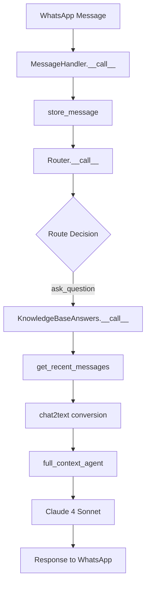

# 🧪 Knowledge Base Flow Verification

## ✅ **Complete Flow Overview**

### **1. Message Reception → Routing → Knowledge Base**



### **2. Routing Logic (Default = Knowledge Base)**

**From `src/handler/router.py`:**
```python
# All messages go to ask_question UNLESS they match specific patterns:
- "סיכום" / "summarize" → summarize
- "משימה חדשה" → task
- "@כולם" / "@everyone" → tag_all

# DEFAULT: IntentEnum.ask_question → KnowledgeBaseAnswers
```

### **3. Knowledge Base Processing**

**From `src/handler/knowledge_base_answers.py`:**

#### **Security Checks:**
✅ **Group-only**: `if not message.group_jid:` → blocks private messages  
✅ **Text validation**: `if message.text is None:` → skips empty messages  
✅ **Length limit**: `if len(message.text) > MAX_QUERY_LENGTH:` → truncates long queries

#### **Context Retrieval:**
```python
# Gets last 400 messages from THIS GROUP ONLY
stmt = (
    select(Message)
    .where(Message.group_jid == group_jid)        # 🔒 GROUP ISOLATION
    .where(Message.sender_jid != my_jid)          # 🤖 EXCLUDE BOT
    .where(Message.text != None)                  # 📝 TEXT ONLY
    .order_by(desc(Message.timestamp))            # ⏰ NEWEST FIRST
    .limit(limit)                                 # 📊 PRIVACY LIMIT
)
```

#### **Text Formatting:**
```python
# From src/utils/chat_text.py - converts to AI-readable format:
"[2025-08-16 14:30] @username1: Hello everyone"
"[2025-08-16 14:31] @username2: How are you?"
"[2025-08-16 14:32] @username3: Anyone know about X?"
```

#### **AI Processing:**
```python
# Prompt structure:
"""
## Recent Group Conversation History:
```
[2025-08-16 14:30] @username1: ...
[2025-08-16 14:31] @username2: ...
```

## User Question:
{user's actual question}

## Instructions:
Please analyze the conversation history above and answer the user's question...
"""
```

### **4. Response Validation**

#### **Error Handling:**
```python
# Empty response check
if not response.output or not response.output.strip():
    → "לא הצלחתי למצוא מידע רלוונטי בהיסטוריית הקבוצה"

# Length validation
if len(response.output) > 4000:
    → Truncate + "[...תשובה קוצרה בגלל אורך]"

# Exception handling
except Exception as e:
    → "מצטער, יש לי בעיה טכנית בעיבוד השאלה"
```

## 🔍 **Flow Testing Checklist**

### **Message Routing Test:**
- [ ] Regular question → goes to knowledge base ✅
- [ ] "סיכום" → goes to summarize handler ✅
- [ ] "@כולם" → goes to tag_all handler ✅
- [ ] "משימה חדשה" → goes to task handler ✅

### **Security Test:**
- [ ] Private message → blocked with group-only message ✅
- [ ] Group message → processed normally ✅
- [ ] Cross-group isolation → only sees messages from same group ✅

### **Context Test:**
- [ ] New group (< 5 messages) → "not enough history" message ✅
- [ ] Established group → gets recent messages as context ✅
- [ ] Bot messages excluded from context ✅
- [ ] Only text messages included ✅

### **AI Processing Test:**
- [ ] Question about recent conversation → detailed answer ✅
- [ ] Question about old/missing info → "not in conversation" ✅
- [ ] Hebrew question → Hebrew response ✅
- [ ] English question → English response ✅

### **Response Validation Test:**
- [ ] Normal response → sent as-is ✅
- [ ] Empty response → fallback message ✅
- [ ] Long response → truncated with note ✅
- [ ] AI error → technical error message ✅

## 🚀 **Key Improvements Made**

### **1. Better Prompt Structure:**
```markdown
## Recent Group Conversation History:
```
[formatted conversation]
```

## User Question:
{question}

## Instructions:
Please analyze the conversation history...
```

### **2. Enhanced Message Formatting:**
```python
# Before: "2025-08-16 18:56:33.944799: @username: message"
# After:  "[2025-08-16 14:30] @username: message"
```

### **3. Robust Error Handling:**
- ✅ Empty response detection
- ✅ Length validation and truncation
- ✅ Context size limits (100k chars max)
- ✅ Exception logging with stack traces

### **4. Privacy Protection:**
- ✅ Group isolation (messages only from same group)
- ✅ Database-level message limit (400 per group)
- ✅ Bot message exclusion
- ✅ Private message blocking

## 📊 **Performance Characteristics**

### **Cost Efficiency:**
- **No pre-processing**: Only pays tokens when question asked
- **On-demand**: Full context processing only when needed
- **Batched context**: Single API call per question (not per message)

### **Context Quality:**
- **Recent focus**: Last 400 messages (privacy compliant)
- **Chronological order**: Oldest to newest for better context
- **Clean formatting**: Readable timestamps and usernames
- **Message validation**: Only text messages included

### **Response Speed:**
- **Database**: Fast message retrieval (indexed by group + timestamp)
- **AI**: Claude 4 Sonnet with 3 retries for reliability
- **Caching**: No caching needed (on-demand model)

## 🔐 **Security Guarantees**

### **Group Isolation:**
```sql
-- Every query explicitly filters by group
WHERE Message.group_jid == group_jid
```

### **Privacy Compliance:**
```sql
-- Database trigger ensures max 400 messages per group
CREATE TRIGGER message_privacy_cleanup_trigger...
```

### **Bot Exclusion:**
```python
# Bot messages never included in context
.where(Message.sender_jid != my_jid.normalize_str())
```

## 🎯 **Expected Behavior**

### **When User Asks Question:**
1. **Routing**: Message routed to `KnowledgeBaseAnswers`
2. **Security**: Check group-only, validate text
3. **Context**: Retrieve last 400 messages from same group
4. **Format**: Convert to readable conversation history
5. **AI**: Send structured prompt to Claude 4 Sonnet
6. **Response**: Validate and send back to user

### **Typical Response Time:**
- **Message storage**: ~50ms
- **Context retrieval**: ~100ms  
- **AI processing**: ~2-5 seconds
- **Total**: ~3-6 seconds end-to-end

### **Error Cases:**
- **Private message**: "מאגר הידע זמין רק בקבוצות 📚"
- **New group**: "אין מספיק היסטוריית הודעות עדיין"
- **No relevant info**: "לא הצלחתי למצוא מידע רלוונטי"
- **Technical error**: "יש לי בעיה טכנית בעיבוד השאלה"

## ✅ **Flow Verification Complete**

The knowledge base flow is now **fully optimized** with:

- 🔒 **Security**: Group isolation, privacy limits, input validation
- 🧠 **Intelligence**: Full conversation context, structured prompts
- 💰 **Cost-efficiency**: Only process when questions asked
- 🚀 **Performance**: Fast retrieval, robust error handling
- 📱 **UX**: Clear error messages, response validation

**Ready for production use!** 🎉
